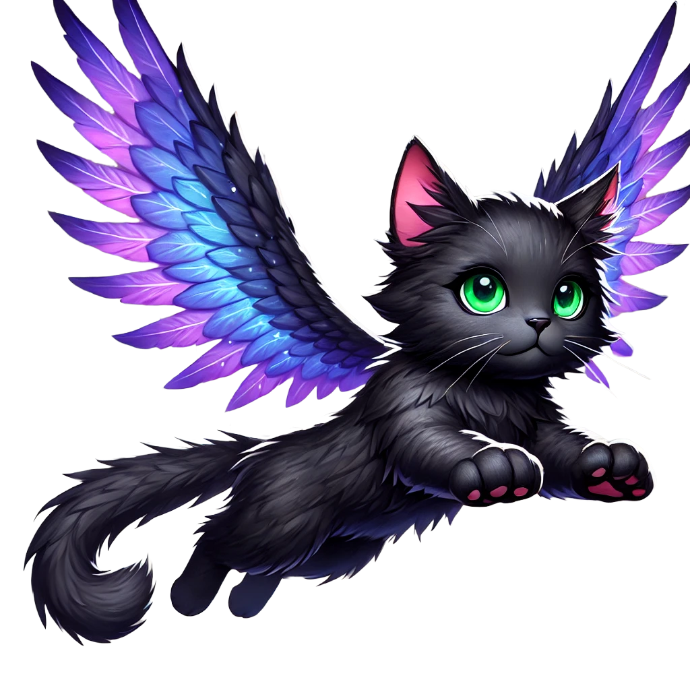

# Flying Whiskers

<div style="display: flex; align-items: flex-start; gap: 20px;">
<div style="flex: 1;">

A charming browser game where you control a magical flying cat chasing sardines in the sky! Built with React and Babylon.js.

Play now: [Flying Whiskers Game](https://pelednoam.github.io/flying-whiskers)

✨ **Now available as a Progressive Web App (PWA)!** Install it on your phone or tablet for the best gaming experience.

</div>
<div style="width: 200px;">

</div>
</div>

## Game Features

- Control a flying cat with magical purple wings
- Chase and catch sardines that try to escape from you
- Beautiful sky background with drifting clouds
- Score tracking system
- Multiple control options (keyboard, mouse, touch)
- Playful background music and meow sound effects
- Responsive design that works on all devices
- Smart sardine AI that tries to escape when the cat gets close
- **Offline Play**: Install as a PWA to play without internet connection
- **Home Screen App**: Add to your device's home screen for quick access

## Installation

### Mobile/Tablet Users
1. Visit [Flying Whiskers Game](https://pelednoam.github.io/flying-whiskers) in your browser
2. You'll see a prompt to "Add to Home Screen" or "Install App"
3. Follow the prompts to install the game
4. The game will appear on your home screen as a standalone app
5. Launch and play anytime, even offline!

### Desktop Users
1. Visit [Flying Whiskers Game](https://pelednoam.github.io/flying-whiskers) in Chrome
2. Click the install icon (➕) in the address bar
3. Click "Install" in the prompt
4. The game will install as a desktop app

## How to Play

### Multiple Control Options:

1. **Keyboard Controls**
   - Use **Arrow Keys** or **WASD** to control the cat's movement
   - Precise digital control for desktop users

2. **Mouse/Trackpad Controls**
   - Click and drag anywhere on the screen
   - The cat follows your mouse/trackpad movement
   - Release to stop moving
   - Optimized for laptop trackpads

3. **Touch Controls**
   - Touch and drag on mobile devices
   - Virtual joystick appears for easy control
   - Optimized for mobile gaming

### Gameplay:
- Guide the cat to catch sardines
- Sardines will actively try to swim away when you get close
- Each catch increases your score and plays a meow sound
- Relaxing background music accompanies your sardine chase
- Click the Restart button in the top right to start a new game

## Getting Started

1. Clone the repository:
```bash
git clone https://github.com/pelednoam/flying-whiskers.git
cd flying-whiskers
```

2. Install dependencies:
```bash
npm install
```

3. Start the development server:
```bash
npm start
```

4. Open [http://localhost:3000](http://localhost:3000) to play the game in your browser

## Technologies Used

- React with TypeScript for type safety
- Babylon.js for game rendering and physics
- CSS for cloud animations and UI
- Web Audio API for sound management
- Responsive design for all devices
- Progressive Web App (PWA) features:
  - Offline gameplay support
  - Home screen installation
  - Full-screen immersive experience
  - Fast loading and caching
- GitHub Pages for deployment

## Development

The game is built using React and TypeScript, with Babylon.js handling the game rendering. Key components include:

- `Game.tsx`: Main game container and UI
- `GameScene.tsx`: Babylon.js scene setup and game logic
- Custom cloud animations using CSS
- Sprite management for the cat and sardines
- Touch, mouse, and keyboard input handling
- Sound management system
- Responsive UI elements
- Service worker for PWA functionality
- Asset caching for offline play

## Building for Production

To create a production build:

```bash
npm run build
```

To deploy to GitHub Pages:

```bash
npm run deploy
```

## Credits

- Game concept and development: Noam Peled
- Cat and sardine artwork
- Sound effects and background music

## License

MIT License
